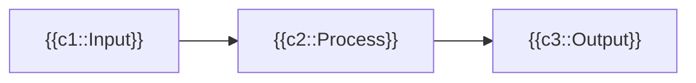

# Anki Advanced Cloze Template

A feature-rich Anki cloze card template with **Mermaid diagram support**, night mode, custom color syntax, and graceful fallbacks — all in a single self-contained front/back template.

---

## Features

- **Mermaid diagram rendering** — embed flowcharts, sequence diagrams, and more directly in your cards
- **Cloze-aware diagrams** — cloze deletions work correctly inside Mermaid node labels, including multi-token labels
- **Night mode support** — automatically adapts cloze colors for dark/light themes
- **Custom color syntax** — highlight arbitrary text with `~={color}text=~`
- **`ask-all` cloze variant** — hide all clozes of a given index simultaneously
- **Table scroll wrapping** — wide tables get a horizontal scroll container automatically
- **Graceful fallback** — if JS rendering fails, Anki's native cloze output is shown instead
- **Zero dependencies at card load** — Mermaid is loaded lazily from CDN only when needed

---

## Installation

1. In Anki, open **Tools → Manage Note Types**
2. Select or create a note type (e.g. `Cloze`)
3. Click **Cards…** to open the card template editor
4. Replace the **Front Template**, **Back Template**, and **Styling** with the code below

### Front Template

Paste the full front template code (the `<div>` blocks + all three `<script>` tags).

### Back Template

```html
<div id="cloze-is-back" hidden="">{{cloze:Text}}</div>
{{FrontSide}}
{{Back Extra}}
```

### Styling

Paste the full CSS block into the **Styling** section.

---

## Usage

### Basic Cloze

Works exactly like standard Anki cloze syntax:

```
The capital of France is {{c1::Paris}}.
```

### Custom Placeholder

```
The speed of light is {{c1::299,792,458 m/s::a large number}} in a vacuum.
```

### Ask-All Variant

Using `ask-all` as the cloze content hides **every** cloze in that group at once:

```
{{c1::ask-all}} Step 1: {{c1::Connect}} → Step 2: {{c1::Configure}} → Step 3: {{c1::Deploy}}
```

### Custom Text Color

Wrap any text in `~={color}...=~` to apply an inline color:

```
~={red}Warning: do not exceed 5V=~
~={green}Safe operating range: 1–3.3V=~
```

### Mermaid Diagrams

Embed diagrams using fenced code blocks, `[mermaid]...[/mermaid]` tags, or `<code class="language-mermaid">` elements:

````

````

Cloze deletions inside node labels are fully supported — the node is sized using the **real content text**, and the visual cloze styling (bracket or revealed text) is injected into the SVG after rendering.

---

## Styling Notes

| Selector | Purpose |
|---|---|
| `.cloze` | Blue bold text (light mode) |
| `.nightMode .cloze` | Light blue text (dark mode) |
| `.cloze, .cloze *` | Forces visibility even inside complex elements |
| `.mermaid-block svg ...` | Prevents SVG clipping of injected cloze labels |
| `.error-icon, .error-text` | Hides Mermaid's built-in error icons |

The `fill: blue` / `fill: lightblue` on `.cloze` is **required** for cloze spans injected into SVG `foreignObject` elements to display the correct color.

---

## Template Architecture

```
Front render pipeline
│
├── #cloze-original       ← Raw {{Text}} field (hidden)
├── #cloze-anki-rendered  ← Anki-processed {{cloze:Text}} (hidden, fallback)
└── #cloze-js-rendered    ← JS-rendered output (visible)
     │
     ├── Script 1: Main renderer
     │    ├── Detects current card index (cardN class)
     │    ├── Parses all {{cN::...}} tokens
     │    ├── Extracts Mermaid blocks → placeholder stubs
     │    ├── Substitutes clozes in HTML
     │    └── Triggers Mermaid async render (if needed)
     │
     ├── Script 2: Table wrapper + empty element cleanup
     │    ├── Wraps <table> in .content-scroll divs
     │    └── Removes empty <li> and <p> elements
     │
     └── Script 3: Fallback
          └── If #cloze-js-rendered is empty → inject Anki fallback
```

### Mermaid Node-Centric Processing

For cloze tokens inside diagram node labels, the template uses a **node-centric** approach:

1. Each node label containing `{{cN::...}}` is extracted
2. A **content label** (all tokens replaced with real text) is sent to Mermaid for correct node sizing
3. A **visual HTML string** (tokens styled as cloze spans or brackets) is stored
4. After Mermaid renders the SVG, each node is located by its Mermaid-assigned ID (`flowchart-NodeId-N`) and its `.nodeLabel` innerHTML is replaced with the visual HTML

This avoids text-search collisions and handles multi-token labels correctly.

---

## Requirements

- **Anki 2.1+** (desktop or AnkiDroid / AnkiMobile with WebView support)
- **Internet access** for Mermaid diagrams (loaded from `cdn.jsdelivr.net`)
- Note type must use the field name `Text` (standard for Anki Cloze types)

---

## Known Limitations

- Mermaid diagrams require an internet connection on first render (CDN-loaded)
- Very complex Mermaid diagrams may render slowly on older devices
- The `ask-all` feature hides sibling clozes but does not affect cloze index ordering
- Edge label overflow workarounds use `!important` overrides on Mermaid's SVG output — may need updating if Mermaid's internal DOM structure changes significantly

---

## License

MIT — free to use, modify, and share.
